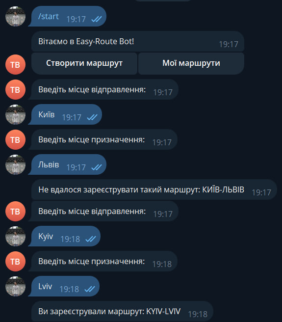
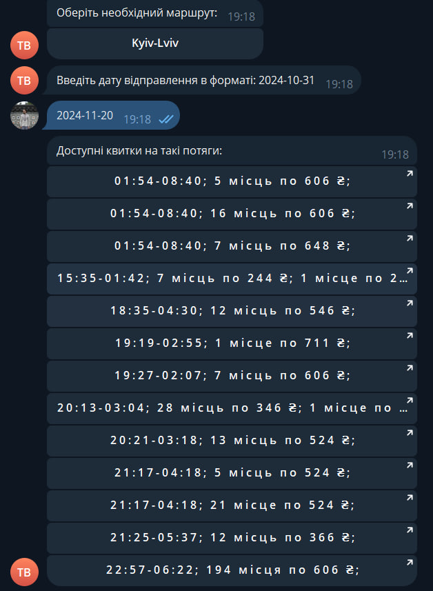

# Easy-Route bot
> Бот, який допоможе знайти квитки на потяг!

## Установка і запуск проекту

```shell
git clone https://github.com/yaroslav-demchenko/easy-route-bot.git
cd /easy-route-bot
python3 -m venv venv
venv\Scripts\activate
pip install -r requirements.txt
# Створіть .env файл і введіть свій TELEGRAM_ACCESS_TOKEN
python main.py run
```

## Приклад роботи
* Запустіть бота командою /start
* Створіть маршрут, ввевши спочатку назву міста відправлення, а потім міста прибуття.
* Оберіть свій маршрут в списку маршрутів і введіть дату на яку вам потрібні квитки
* Після цього бот буде шукати інформацію і видасть інформацію про квитки
* Натиснувши на будь який квиток ви перейдете на сайт для бронювання

## Cкріншоти роботи


